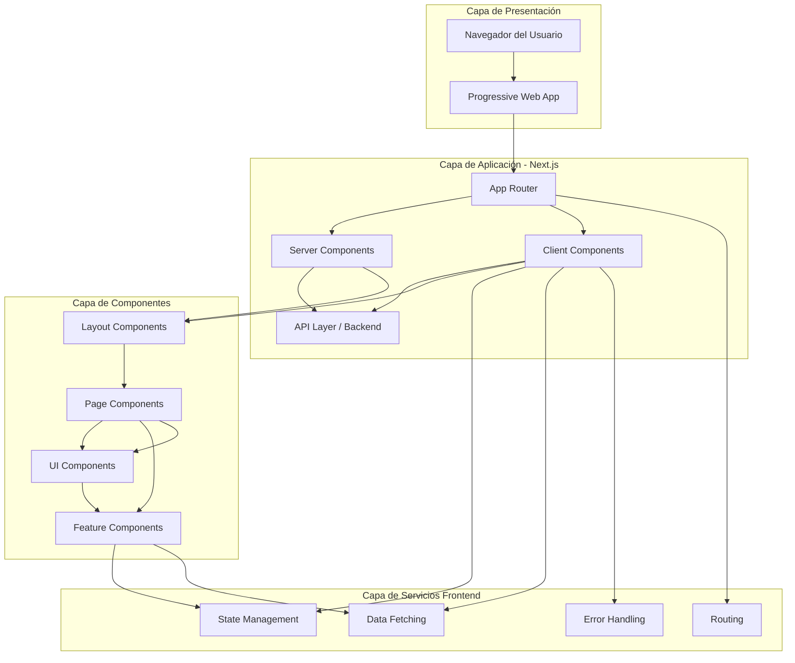
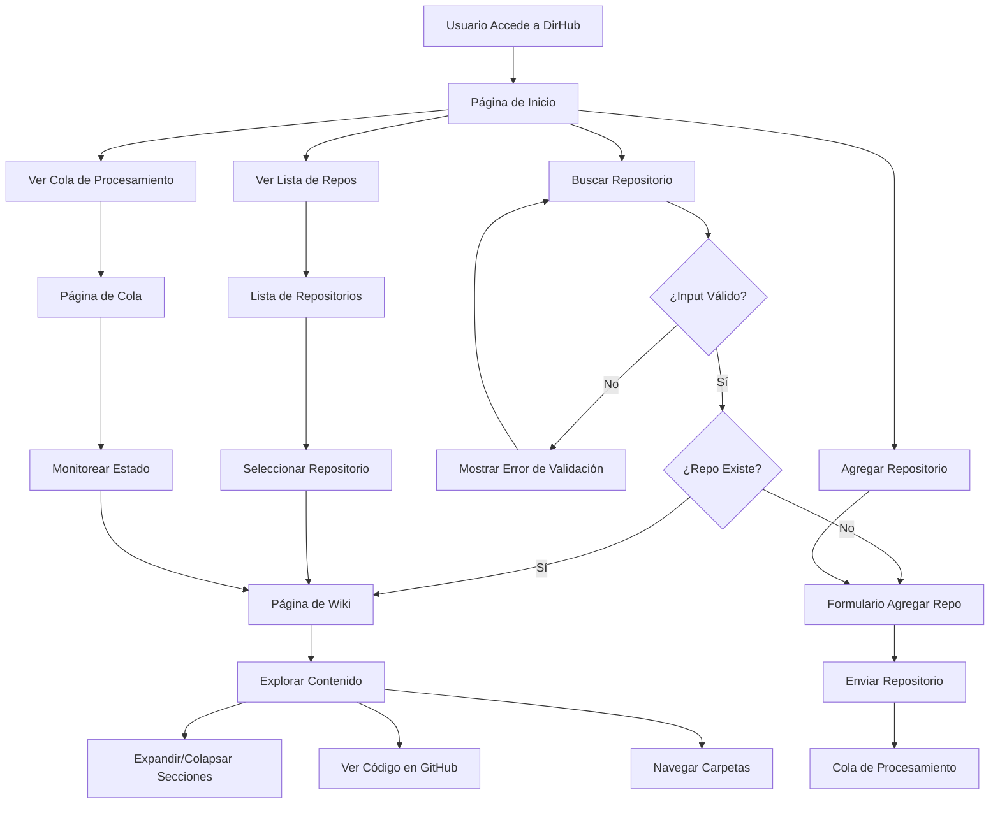
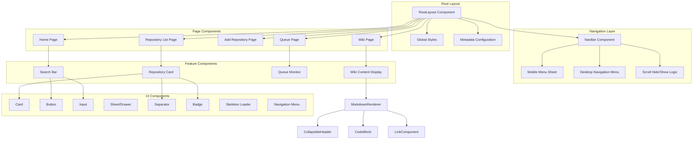

# Diagramas Mermaid — DirHub

A continuación se incluyen los diagramas Mermaid principales usados en la especificación.

## Arquitectura General

## Flujo de Navegación de Usuario

## Diagrama de Componentes

